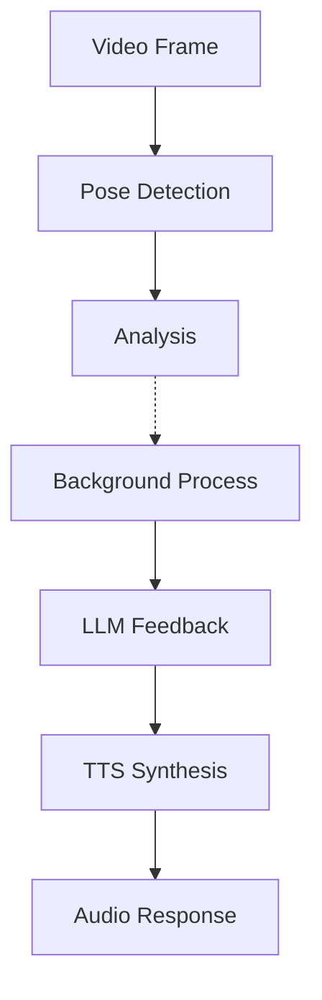
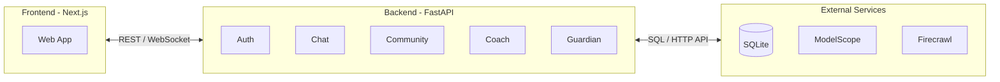

# Architecture

Technical architecture overview of MomShell.

## Tech Stack

### Backend

| Technology              | Purpose                                   |
| ----------------------- | ----------------------------------------- |
| **FastAPI**             | High-performance async web framework      |
| **MediaPipe**           | Real-time pose detection (33 landmarks)   |
| **LangGraph**           | Workflow orchestration for coaching logic |
| **Edge TTS**            | Microsoft neural voice synthesis          |
| **SQLite + SQLAlchemy** | Lightweight async database                |

### Frontend

| Technology       | Purpose                         |
| ---------------- | ------------------------------- |
| **Next.js 14**   | React framework with App Router |
| **TypeScript**   | Type-safe development           |
| **Tailwind CSS** | Utility-first styling           |

## Project Structure

```
MomShell/
├── backend/                    # FastAPI backend
│   ├── app/
│   │   ├── api/v1/             # REST + WebSocket routes
│   │   ├── core/               # Configuration and database
│   │   ├── models/             # ML models dir (gitignored)
│   │   ├── schemas/            # Pydantic schemas (coach)
│   │   ├── services/           # Business logic
│   │   │   ├── auth/           # JWT, OAuth authentication
│   │   │   ├── chat/           # Soul Companion service
│   │   │   ├── coach/          # Recovery Coach service
│   │   │   │   ├── analysis/   # Pose analysis & scoring
│   │   │   │   ├── exercises/  # Exercise library
│   │   │   │   ├── feedback/   # LLM feedback & TTS
│   │   │   │   ├── pose/       # MediaPipe detection
│   │   │   │   ├── progress/   # Progress tracking
│   │   │   │   └── workflow/   # LangGraph workflow
│   │   │   ├── community/      # Sisterhood Bond service
│   │   │   │   ├── moderation/ # Content moderation
│   │   │   │   ├── router/     # Community API routes
│   │   │   │   └── schemas/    # Community schemas
│   │   │   └── guardian/       # Guardian Partner service
│   │   ├── static/             # Static assets
│   │   │   ├── css/
│   │   │   └── js/
│   │   └── templates/          # HTML templates
│   ├── data/                   # Database storage (gitignored)
│   ├── models/                 # ML models (gitignored)
│   ├── scripts/                # CLI scripts (create_admin, etc.)
│   └── tests/                  # Backend tests
│
├── frontend/                   # Next.js frontend
│   ├── app/                    # App router pages
│   │   ├── auth/               # Auth pages
│   │   │   ├── login/
│   │   │   ├── register/
│   │   │   ├── forgot-password/
│   │   │   └── reset-password/
│   │   ├── chat/               # Soul Companion
│   │   ├── coach/              # Recovery Coach
│   │   ├── community/          # Sisterhood Bond
│   │   │   ├── admin/          # Admin pages (certification review)
│   │   │   ├── certification/  # Professional certification
│   │   │   ├── collections/    # Shell Picks
│   │   │   ├── my-posts/       # My questions
│   │   │   ├── my-replies/     # My answers
│   │   │   └── profile/        # User profile
│   │   └── guardian/           # Guardian Partner
│   ├── components/             # React components
│   │   ├── auth/
│   │   ├── coach/
│   │   ├── community/
│   │   ├── guardian/
│   │   └── home/
│   ├── contexts/               # React contexts (AuthContext)
│   ├── hooks/                  # Custom hooks
│   ├── lib/                    # Utilities & API clients
│   │   └── api/                # API client modules
│   ├── public/                 # Public assets
│   └── types/                  # TypeScript definitions
│
├── deploy/                     # Deployment configs
│   ├── docker-compose.yml
│   └── nginx.conf
│
├── docs/                       # Documentation
│   ├── README.md               # Documentation index
│   ├── features.md             # Feature descriptions
│   ├── getting-started.md      # Quick start guide
│   ├── development.md          # Development guide
│   ├── deployment.md           # Docker deployment
│   ├── configuration.md        # Environment variables
│   └── architecture.md         # This file
│
├── scripts/                    # Project-level scripts
│   └── dev-setup.sh            # Development setup script
│
├── .github/                    # GitHub configs
│   ├── ISSUE_TEMPLATE/         # Issue templates
│   └── workflows/              # CI/CD workflows
│
├── .env.example                # Environment template
├── Dockerfile                  # Combined container (ModelScope)
├── Makefile                    # Build commands
├── CONTRIBUTING.md             # Contribution guidelines
└── README.md                   # Project README
```

## Architecture Highlights

### Real-time Pose Detection

- Uses MediaPipe Pose Landmarker with VIDEO mode for tracking
- LITE model by default for better performance (configurable via `MEDIAPIPE_MODEL`)
- Client-side skeleton rendering for minimal latency
- WebSocket protocol for real-time bidirectional communication

### Non-blocking Feedback Pipeline



- LLM feedback generation runs in background
- TTS synthesis is fire-and-forget
- No blocking of the frame processing pipeline

### WebSocket Protocol

- Client sends video frames
- Server returns keypoints
- Skeleton drawn on client side for smooth 20+ FPS experience

### Data Flow



---

[Back to Documentation Index](README.md) | [Back to main README](../README.md)
